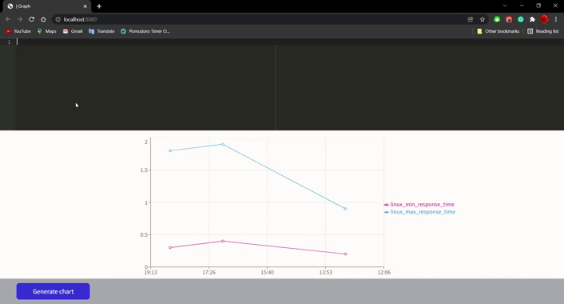

<h1 align="center" >| Graph</h1>

<p align="center">
  <a href="#-about">About</a>&nbsp;&nbsp;&nbsp;|&nbsp;&nbsp;&nbsp;
  <a href="#-technologies">Technologies</a>&nbsp;&nbsp;&nbsp;|&nbsp;&nbsp;&nbsp;  
  <a href="#-features">Features</a>&nbsp;&nbsp;&nbsp;|&nbsp;&nbsp;&nbsp; 
</p>
<br/>
<br/>
<br/>
<p align="center">
  
</p>
<br/>
<br/>

## About
This challenge plots line graphs of manually entered data. Through a code editor, the user can enter the values, and the App processes these values and plots it on a graph.<br/>
During the implementation, concepts such as: SOLID, dependency injection and clean architecture were considered.
A MAX_VALUE constant was also defined, in order to limit or maximum data to be processed.
Another point considered was to notify the user in case of inconsistency of the data provided.<br/>
<br/>
There are 4 types of data:<br/>
- "start": initial data, the user defines groups and parameters for the App to create the Series.<br/>
- "data': enter all values of groups and parameters.<br/>
- "span": insert interval (time) for plotting data.<br/>
- "stop": ignore the follows data until get a data "start" type <br/>

After insert the values, the user can generate the line chart with the data provided.<br/>


## 🛠 Technologies
- Npm
- ReactJSt
- Typescript
- HTML
- SASS
- Recharts
- AceEditor


## 🚀 Features
- [x] Validate input data.
- [x] Process input data and generate data series for plotting.
- [x] Plots line graphs with the input data.


### Running
```bash
# Clone this repository
$ git clone 

# Access the project folder and install dependencies
$ cd plotting-charts-with-editorCode-reactjs/
$ npm i

# Run the application
$ npm start

```

---
<p align="center">Developed by Georgina Rojas :hearts:</p>
